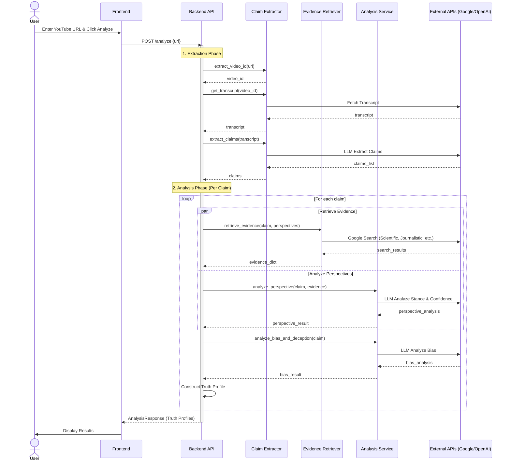

# System Architecture

## High-Level Architecture

```mermaid
graph TD
    User[User] -->|Interacts with| Client[Frontend (React/Vite)]
    Client -->|HTTP/JSON| API[Backend API (FastAPI)]
    
    subgraph Backend Services
        API -->|Uses| CE[Claim Extractor]
        API -->|Uses| ER[Evidence Retriever]
        API -->|Uses| AS[Analysis Service]
    end
    
    subgraph External APIs
        CE -->|Fetches| YT[YouTube Transcript API]
        ER -->|Queries| GCS[Google Custom Search API]
        AS -->|Prompts| LLM[OpenAI API]
    end
    
    style User fill:#f9f,stroke:#333,stroke-width:2px
    style Client fill:#bbf,stroke:#333,stroke-width:2px
    style API fill:#bfb,stroke:#333,stroke-width:2px
    style CE fill:#dfd,stroke:#333,stroke-width:1px
    style ER fill:#dfd,stroke:#333,stroke-width:1px
    style AS fill:#dfd,stroke:#333,stroke-width:1px
```

## Analysis Flow


